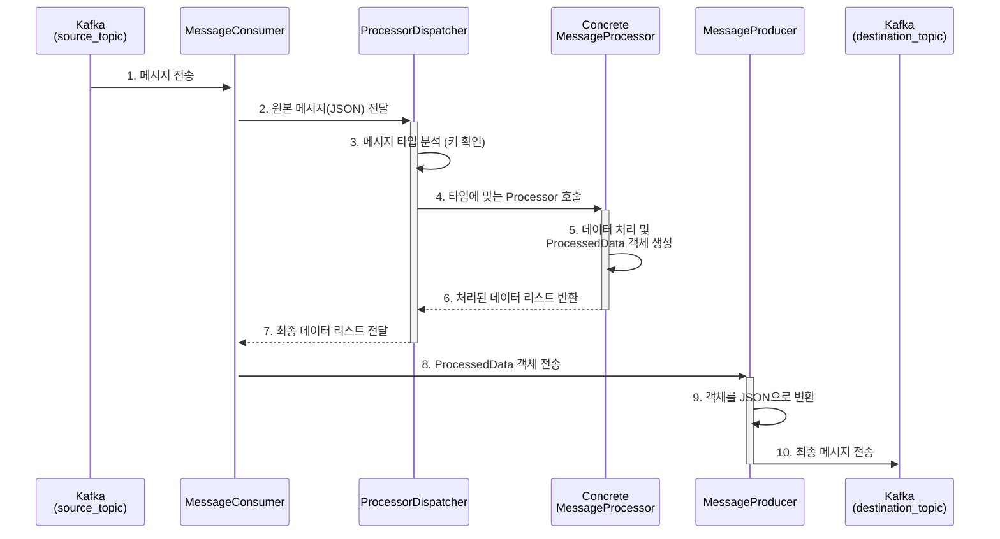

# Java Kafka Processor

Java 기반 Kafka Consumer/Producer를 사용하여 라이더 센서 데이터를 수신, 처리 및 재전송하는 시스템입니다.

## 📋 목차

- [개요](#개요)
- [주요 기능](#주요-기능)
- [시스템 아키텍처](#시스템-아키텍처)
- [프로젝트 구조](#프로젝트-구조)
- [빌드 및 실행](#빌드-및-실행)
- [설정](#설정)
- [데이터 처리 흐름](#데이터-처리-흐름)
- [클래스 설명](#클래스-설명)

## 개요

이 프로젝트는 Python 버전(`kafka_message_processor`)의 Java 구현체입니다. Kafka를 사용하여 소스 토픽에서 센서 데이터를 수신하고, 타입별로 처리한 후, 목적지 토픽으로 전송합니다. Gradle 기반 빌드 시스템을 사용하며, 타입 안정성과 성능을 제공합니다.

## 주요 기능

### 1. 타입 안전한 데이터 처리
- POJO(Plain Old Java Object) 기반 데이터 모델
- Gson을 사용한 JSON 직렬화/역직렬화
- 컴파일 타임 타입 체크

### 2. 디스패처 패턴
- `ProcessorDispatcher`를 통한 자동 프로세서 선택
- 인터페이스 기반 확장 가능한 프로세서 구조
- 새로운 데이터 타입 추가 용이

### 3. Kafka 스트리밍
- Kafka Consumer API를 사용한 메시지 수신
- Kafka Producer API를 사용한 메시지 전송
- 안전한 리소스 관리 (Graceful Shutdown)

### 4. 다중 데이터 타입 지원
- BLE 센서 데이터
- LTE V1 센서 데이터
- LTE V2 센서 데이터 (LOCATION 필드 지원)
- Nonesub 사용자 데이터

## 시스템 아키텍처

```
┌─────────────────┐
│ Kafka Source    │
│     Topic       │
└────────┬────────┘
         │
         ▼
┌─────────────────┐
│ MessageConsumer │
└────────┬────────┘
         │ (JSON String)
         ▼
┌─────────────────┐
│   Processor     │
│   Dispatcher    │
└────────┬────────┘
         │
    ┌────┴────┐
    │ Analyze │
    │  Type   │
    └────┬────┘
         │
    ┌────┴────────────────────┐
    │                         │
    ▼                         ▼
┌──────────┐          ┌──────────┐
│   BLE    │   ...    │   LTE    │
│Processor │          │Processor │
└────┬─────┘          └────┬─────┘
     │                     │
     └──────────┬──────────┘
                │
                ▼ (List<ProcessedData>)
         ┌─────────────┐
         │   Message   │
         │   Producer  │
         └──────┬──────┘
                │
                ▼
         ┌─────────────┐
         │    Kafka    │
         │ Destination │
         │    Topic    │
         └─────────────┘
```

## 프로젝트 구조

```
java_kafka_processor/
├── build.gradle                    # Gradle 빌드 스크립트
├── settings.gradle                 # Gradle 프로젝트 설정
├── process.md                      # 아키텍처 상세 문서
└── src/
    └── main/
        ├── java/com/example/kafkaprocessor/
        │   ├── Main.java                          # 애플리케이션 진입점
        │   ├── consumer/
        │   │   └── MessageConsumer.java           # Kafka Consumer 및 메인 로직
        │   ├── model/                             # 데이터 모델 (POJO)
        │   │   ├── IncomingPayload.java           # 입력 데이터 모델
        │   │   ├── ProcessedData.java             # 출력 데이터 모델
        │   │   ├── GnssData.java                  # GNSS 중첩 객체
        │   │   ├── ImuData.java                   # IMU 중첩 객체
        │   │   └── TravelData.java                # Travel 중첩 객체
        │   ├── processor/                         # 비즈니스 로직
        │   │   ├── MessageProcessor.java          # Processor 인터페이스
        │   │   ├── ProcessorDispatcher.java       # 프로세서 선택 및 디스패칭
        │   │   ├── BleDataProcessor.java          # BLE 데이터 처리
        │   │   ├── LteDataProcessor.java          # LTE V1 데이터 처리
        │   │   ├── LteV2DataProcessor.java        # LTE V2 데이터 처리
        │   │   └── NonesubDataProcessor.java      # Nonesub 데이터 처리
        │   └── producer/
        │       └── MessageProducer.java           # Kafka Producer
        └── resources/
            └── application.properties             # Kafka 설정 파일
```

## 빌드 및 실행

### 필요 조건
- Java 11 이상
- Gradle 8.x (Gradle Wrapper 포함)
- 실행 중인 Kafka 브로커

### 설정 파일 수정

`src/main/resources/application.properties` 파일을 환경에 맞게 수정:

```properties
# Kafka 브로커 주소
kafka.bootstrap.servers=localhost:9092

# 토픽 이름
kafka.source.topic=source_topic
kafka.destination.topic=destination_topic

# 컨슈머 그룹 ID
kafka.consumer.group.id=java-kafka-processor-group
```

### Gradle Wrapper 생성 (필요 시)

```bash
# Gradle이 설치되어 있는 경우
gradle wrapper
```

### 빌드

```bash
# 프로젝트 루트 디렉터리에서 실행
./gradlew build
```

### 실행

```bash
# Gradle을 통한 실행
./gradlew run

# 또는 JAR 파일 직접 실행
java -jar build/libs/java_kafka_processor-1.0-SNAPSHOT.jar
```

### 테스트 실행

```bash
./gradlew test
```

## 설정

### `application.properties`

| 속성 | 설명 | 기본값 |
|------|------|--------|
| `kafka.bootstrap.servers` | Kafka 브로커 주소 | `localhost:9092` |
| `kafka.source.topic` | 소스 토픽 이름 | `source_topic` |
| `kafka.destination.topic` | 목적지 토픽 이름 | `destination_topic` |
| `kafka.consumer.group.id` | Kafka 컨슈머 그룹 ID | `java-kafka-processor-group` |

### Kafka Consumer 주요 설정

```java
Properties props = new Properties();
props.put("bootstrap.servers", bootstrapServers);
props.put("group.id", groupId);
props.put("key.deserializer", "org.apache.kafka.common.serialization.StringDeserializer");
props.put("value.deserializer", "org.apache.kafka.common.serialization.StringDeserializer");
props.put("auto.offset.reset", "earliest");
props.put("enable.auto.commit", "true");
```

## 데이터 처리 흐름

### 상세 처리 단계



### 단계별 설명

1. **메시지 수신**: `MessageConsumer`가 Kafka `source_topic`을 구독하고 메시지를 수신
2. **처리 위임**: Consumer가 JSON 문자열을 `ProcessorDispatcher`에 전달
3. **타입 분석**: Dispatcher가 JSON을 `IncomingPayload`로 변환하고 키를 확인
4. **프로세서 호출**: 타입에 맞는 `MessageProcessor` 구현체 호출
5. **데이터 가공**: Processor가 비즈니스 로직을 수행하고 `ProcessedData` 리스트 생성
6. **결과 반환**: 처리된 데이터 리스트가 Dispatcher를 거쳐 Consumer로 반환
7. **전송 준비**: Consumer가 각 데이터를 Producer로 전달
8. **직렬화**: Producer가 `ProcessedData` 객체를 JSON으로 변환
9. **메시지 전송**: Kafka `destination_topic`으로 메시지 전송

## 클래스 설명

### 1. Model 패키지

#### `IncomingPayload.java`
소스 토픽에서 수신한 원본 JSON 메시지의 모든 필드를 포함하는 메인 모델입니다.

```java
public class IncomingPayload {
    private String TITLE;
    private List<Map<String, ImuData>> IMU;
    private GnssData GNSS;
    private TravelData TRAVEL;
    private List<Double> LOCATION;
    private Long TIME;
    // getters and setters...
}
```

#### `ProcessedData.java`
처리된 후 목적지 토픽으로 전송될 최종 데이터 구조입니다. Builder 패턴을 사용합니다.

```java
public class ProcessedData {
    private String sensorId;
    private String phoneNum;
    private long time;
    private int accelX, accelY, accelZ;
    private int gyroX, gyroY, gyroZ;
    private double pitch, roll;
    private double lat, lon;
    private double velocity, altitude, bearing;
    private Integer travelTime, travelDistance;

    // Builder pattern
    public static class Builder { ... }
}
```

#### `GnssData.java`, `ImuData.java`, `TravelData.java`
중첩된 JSON 객체를 위한 모델 클래스들입니다.

### 2. Processor 패키지

#### `MessageProcessor.java` (인터페이스)
모든 프로세서가 구현해야 하는 인터페이스입니다.

```java
public interface MessageProcessor {
    List<ProcessedData> process(IncomingPayload payload);
}
```

#### `ProcessorDispatcher.java`
메시지 타입을 분석하여 적절한 프로세서를 선택하고 실행합니다.

```java
public class ProcessorDispatcher {
    private final Gson gson = new Gson();

    public List<ProcessedData> dispatch(String jsonMessage) {
        IncomingPayload payload = gson.fromJson(jsonMessage, IncomingPayload.class);

        // 타입 감지 로직
        if (payload.getTRAVEL() != null) {
            if (payload.getLOCATION() != null) {
                return new LteV2DataProcessor().process(payload);
            } else {
                return new LteDataProcessor().process(payload);
            }
        } else if (payload.getIMU() != null && payload.getGNSS() != null) {
            return new BleDataProcessor().process(payload);
        } else if (payload.getTIME() != null && payload.getGNSS() != null) {
            return new NonesubDataProcessor().process(payload);
        }

        return Collections.emptyList();
    }
}
```

#### `BleDataProcessor.java`
BLE 센서 데이터를 처리합니다.

**처리 로직:**
- TITLE 파싱: `sensor_id_phone_num_date`
- IMU 데이터 리스트를 순회하며 각 타임스탬프별 데이터 추출
- 단일 GNSS 값을 모든 데이터 포인트에 적용

#### `LteDataProcessor.java`
LTE V1 센서 데이터를 처리합니다.

**처리 로직:**
- TITLE 파싱: `sensor_id_phone_num`
- IMU 배열을 3개씩 묶어서 처리 (`ACCEL`, `GYRO`, `ATTITUDE` 각각)
- 5초 주기를 데이터 개수로 균등 분할하여 타임스탬프 할당
- TRAVEL 정보 포함

```java
int timeInterval = 5000; // 5초
int k = imuValues.getAccel().size() / 3;
for (int i = 0; i < k; i++) {
    long timestamp = baseTime + (long)(i * (timeInterval / (double)k));
    // 데이터 처리...
}
```

#### `LteV2DataProcessor.java`
LTE V2 센서 데이터를 처리합니다.

**처리 로직:**
- LTE V1과 유사하지만 10초 주기
- `LOCATION` 배열이 있으면 개별 위치 정보 사용 (4개씩 묶음: lat, lon, alt, vel)
- 없으면 단일 GNSS 값 사용

```java
int timeInterval = 10000; // 10초
if (payload.getLOCATION() != null) {
    int locationIndex = i * 4;
    lat = location.get(locationIndex);
    lon = location.get(locationIndex + 1);
    altitude = location.get(locationIndex + 2);
    velocity = location.get(locationIndex + 3);
}
```

#### `NonesubDataProcessor.java`
비구독 사용자의 위치 데이터를 처리합니다.

**처리 로직:**
- TITLE 파싱: `phone_num_date`
- IMU 데이터 없이 GNSS만 처리
- 단일 데이터 포인트만 생성

### 3. Consumer 패키지

#### `MessageConsumer.java`
Kafka Consumer를 실행하고 메시지 처리 루프를 관리합니다.

**주요 기능:**
- Kafka Consumer 초기화 및 구독
- 메시지 수신 루프
- ProcessorDispatcher를 통한 데이터 처리
- MessageProducer를 통한 결과 전송
- Graceful Shutdown (ShutdownHook)

```java
public void start() {
    consumer.subscribe(Collections.singletonList(sourceTopic));

    while (running.get()) {
        ConsumerRecords<String, String> records = consumer.poll(Duration.ofMillis(100));

        for (ConsumerRecord<String, String> record : records) {
            String message = record.value();
            List<ProcessedData> processedDataList = dispatcher.dispatch(message);

            for (ProcessedData data : processedDataList) {
                producer.send(data);
            }
        }
    }
}
```

### 4. Producer 패키지

#### `MessageProducer.java`
처리된 데이터를 Kafka 목적지 토픽으로 전송합니다.

**주요 기능:**
- Kafka Producer 초기화
- `ProcessedData` → JSON 변환 (Gson)
- 목적지 토픽으로 메시지 전송
- 리소스 정리 (close)

```java
public void send(ProcessedData data) {
    String jsonMessage = gson.toJson(data);
    ProducerRecord<String, String> record =
        new ProducerRecord<>(destinationTopic, jsonMessage);
    producer.send(record);
}
```

### 5. Main 클래스

#### `Main.java`
애플리케이션의 진입점입니다.

**역할:**
- `application.properties` 로드
- `MessageConsumer` 생성 및 시작
- ShutdownHook 등록 (안전한 종료)

```java
public static void main(String[] args) {
    Properties config = loadConfig();
    MessageConsumer consumer = new MessageConsumer(config);

    Runtime.getRuntime().addShutdownHook(new Thread(consumer::stop));

    consumer.start();
}
```

## 의존성

### Gradle Dependencies

```gradle
dependencies {
    // Kafka client
    implementation 'org.apache.kafka:kafka-clients:3.6.1'

    // JSON processing
    implementation 'com.google.code.gson:gson:2.10.1'

    // Logging
    implementation 'org.slf4j:slf4j-api:2.0.9'
    runtimeOnly 'org.slf4j:slf4j-simple:2.0.9'

    // Testing
    testImplementation platform('org.junit:junit-bom:5.9.1')
    testImplementation 'org.junit.jupiter:junit-jupiter'
}
```

## 데이터 타입 비교

| 데이터 타입 | TITLE 형식 | 시간 간격 | IMU 배열 | LOCATION | TRAVEL |
|------------|-----------|----------|---------|----------|--------|
| **BLE** | `sensor_id_phone_num_date` | 실시간 | 단일 값 | ❌ | ❌ |
| **LTE V1** | `sensor_id_phone_num` | 5초 | 3의 배수 | ❌ | ✅ |
| **LTE V2** | `sensor_id_phone_num` | 10초 | 3의 배수 | ✅ (4의 배수) | ✅ |
| **Nonesub** | `phone_num_date` | 단일 | ❌ | ❌ | ❌ |

## Python 버전과의 차이점

| 항목 | Python 버전 | Java 버전 |
|------|------------|-----------|
| **타입 안정성** | 동적 타입 (dict) | 정적 타입 (POJO) |
| **JSON 처리** | 내장 `json` 모듈 | Gson 라이브러리 |
| **에러 핸들링** | 함수 레벨 try-except | 클래스 메서드 레벨 |
| **코드 구조** | 함수 기반 | 객체 지향 (인터페이스, 클래스) |
| **빌드 도구** | pip | Gradle |
| **실행 방식** | 인터프리터 | JVM (컴파일 후 실행) |

## 확장 방법

### 새로운 데이터 타입 추가

1. **새 Processor 클래스 생성**:
```java
public class NewTypeDataProcessor implements MessageProcessor {
    @Override
    public List<ProcessedData> process(IncomingPayload payload) {
        // 처리 로직 구현
        return processedDataList;
    }
}
```

2. **ProcessorDispatcher 수정**:
```java
public List<ProcessedData> dispatch(String jsonMessage) {
    // 기존 로직...
    else if (payload.getNEW_FIELD() != null) {
        return new NewTypeDataProcessor().process(payload);
    }
}
```

3. **IncomingPayload에 필드 추가** (필요 시):
```java
public class IncomingPayload {
    // 기존 필드...
    private NewTypeField NEW_FIELD;

    public NewTypeField getNEW_FIELD() { return NEW_FIELD; }
    public void setNEW_FIELD(NewTypeField NEW_FIELD) { this.NEW_FIELD = NEW_FIELD; }
}
```

## 트러블슈팅

### 1. Kafka 연결 실패
```
ERROR: Connection to node -1 could not be established
```
**해결 방법:**
- Kafka 브로커가 실행 중인지 확인
- `application.properties`의 `kafka.bootstrap.servers` 확인
- 방화벽 설정 확인

### 2. JSON 파싱 에러
```
ERROR: Failed to parse JSON message
```
**해결 방법:**
- 메시지 형식이 올바른지 확인
- `IncomingPayload` 모델이 JSON 구조와 일치하는지 확인
- Gson 역직렬화 에러 로그 확인

### 3. 처리되지 않는 메시지
**확인 사항:**
- `ProcessorDispatcher.dispatch()`의 타입 감지 로직 검토
- 로그에 "Unknown message type" 출력 확인
- 페이로드에 필수 키가 존재하는지 확인

### 4. OutOfMemoryError
**해결 방법:**
- JVM 힙 메모리 증가:
```bash
java -Xmx2g -jar build/libs/java_kafka_processor-1.0-SNAPSHOT.jar
```
- 배치 처리 크기 조정
- Consumer `max.poll.records` 설정 낮추기

## 성능 최적화

### 1. 배치 처리
여러 메시지를 모아서 한 번에 전송:

```java
List<ProcessedData> batchList = new ArrayList<>();
for (ConsumerRecord<String, String> record : records) {
    List<ProcessedData> processed = dispatcher.dispatch(record.value());
    batchList.addAll(processed);
}

// 배치로 전송
for (ProcessedData data : batchList) {
    producer.send(data);
}
producer.flush();
```

### 2. Producer 설정 최적화
```properties
# application.properties
kafka.producer.batch.size=16384
kafka.producer.linger.ms=10
kafka.producer.compression.type=snappy
```

### 3. Consumer 설정 최적화
```properties
kafka.consumer.max.poll.records=500
kafka.consumer.fetch.min.bytes=1024
```

## 모니터링 및 로깅

### SLF4J 로깅 설정

`src/main/resources/simplelogger.properties` 파일 생성:

```properties
org.slf4j.simpleLogger.defaultLogLevel=info
org.slf4j.simpleLogger.log.com.example.kafkaprocessor=debug
org.slf4j.simpleLogger.showDateTime=true
org.slf4j.simpleLogger.dateTimeFormat=yyyy-MM-dd HH:mm:ss
```

### 처리량 모니터링

Consumer에 카운터 추가:

```java
private final AtomicLong processedCount = new AtomicLong(0);

// 주기적으로 출력
logger.info("Processed {} messages", processedCount.incrementAndGet());
```

## 관련 프로젝트

- **RabbitMQ 버전**: `riderLogMQReceiver` (Celery 기반)
- **Python Kafka 버전**: `kafka_message_processor`

## 참고 문서

- [process.md](process.md) - 아키텍처 및 프로세스 상세 설명
- [Apache Kafka Documentation](https://kafka.apache.org/documentation/)
- [Gson User Guide](https://github.com/google/gson/blob/master/UserGuide.md)


