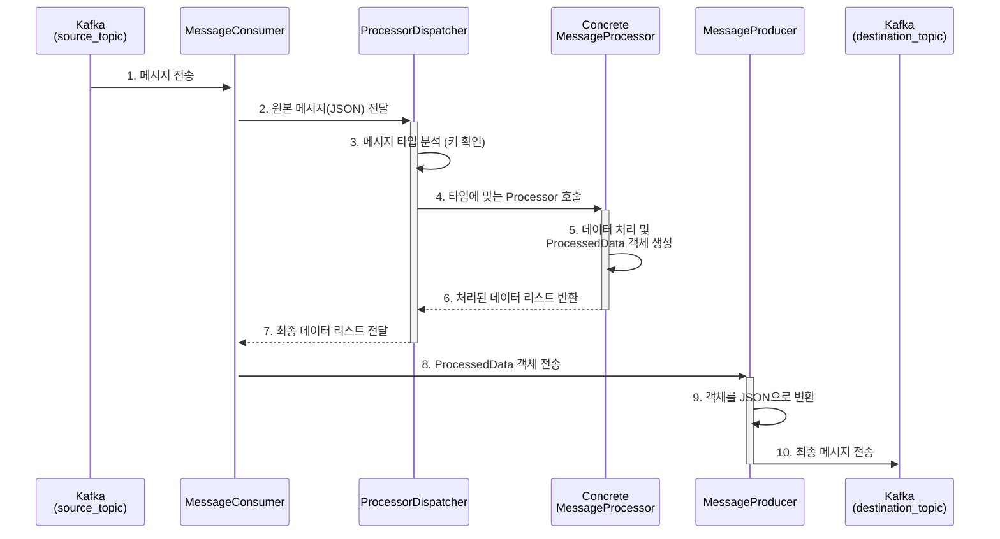

# Java Kafka Processor: 아키텍처 및 프로세스 설명

## 1. 개요

이 문서는 `java_kafka_processor` 프로젝트의 구조, 주요 컴포넌트의 역할, 그리고 Kafka 메시지가 처리되는 전체 흐름을 설명합니다. 이 프로젝트는 특정 Kafka 토픽(`source_topic`)에서 메시지를 수신하여, 비즈니스 로직에 따라 데이터를 가공한 후, 다른 Kafka 토픽(`destination_topic`)으로 전송하는 것을 목표로 합니다.

## 2. 프로젝트 구조

프로젝트는 표준 Gradle 프로젝트 구조를 따르며, 각 디렉터리와 파일의 역할은 다음과 같습니다.

```
java_kafka_processor/
├── build.gradle                # Gradle 빌드 스크립트 (의존성 관리, 빌드/실행 설정)
├── settings.gradle             # Gradle 프로젝트 이름 설정
└── src/
    └── main/
        ├── java/
        │   └── com/example/kafkaprocessor/
        │       ├── Main.java               # 애플리케이션 시작점 (Entry Point)
        │       ├── consumer/
        │       │   └── MessageConsumer.java # Kafka 메시지를 수신하고 전체 흐름을 제어
        │       ├── model/                  # 데이터 모델 (POJO 클래스)
        │       │   ├── GnssData.java
        │       │   ├── ImuData.java
        │       │   ├── IncomingPayload.java
        │       │   ├── ProcessedData.java
        │       │   └── TravelData.java
        │       ├── producer/
        │       │   └── MessageProducer.java # 처리된 메시지를 Kafka로 전송
        │       └── processor/
        │           ├── BleDataProcessor.java    # 각 데이터 타입별 처리 로직
        │           ├── LteDataProcessor.java
        │           ├── LteV2DataProcessor.java
        │           ├── MessageProcessor.java  # Processor 인터페이스
        │           ├── NonesubDataProcessor.java
        │           └── ProcessorDispatcher.java # 메시지 타입에 따라 적절한 Processor를 선택
        └── resources/
            └── application.properties    # Kafka 브로커, 토픽 등 주요 설정
```

## 3. 핵심 컴포넌트 설명

### 3.1. `model` 패키지
JSON으로 수신된 데이터를 Java에서 타입에 안전하게 다루기 위한 POJO(Plain Old Java Object) 클래스들이 위치합니다.
- **`IncomingPayload`**: 소스 토픽에서 수신한 원본 JSON 메시지의 모든 가능한 필드를 포함하는 메인 모델입니다.
- **`ProcessedData`**: 처리가 완료된 후 목적지 토픽으로 전송될 최종 데이터 구조를 정의합니다.
- `GnssData`, `ImuData`, `TravelData`: `IncomingPayload` 내의 중첩된 JSON 객체들을 위한 모델입니다.

### 3.2. `processor` 패키지
메시지를 실질적으로 처리하는 비즈니스 로직이 구현된 곳입니다.
- **`MessageProcessor` (인터페이스)**: 모든 프로세서가 구현해야 하는 `process` 메서드를 정의합니다. 이는 일관된 처리 방식을 강제합니다.
- **`BleDataProcessor`, `LteDataProcessor` 등**: `MessageProcessor`를 구현하며, 각 데이터 타입(BLE, LTE 등)에 맞는 구체적인 처리 로직을 담당합니다.
- **`ProcessorDispatcher`**: 수신된 메시지의 내용을 분석하여 어떤 `Processor` 구현체를 사용해야 할지 결정하고 작업을 위임하는 역할을 합니다.

### 3.3. `consumer` & `producer` 패키지
Kafka와의 통신을 담당합니다.
- **`MessageConsumer`**: `source_topic`을 구독하고, 새로운 메시지가 들어오면 `ProcessorDispatcher`에게 전달하여 처리를 시작합니다. 처리된 결과는 `MessageProducer`에게 넘깁니다.
- **`MessageProducer`**: `MessageConsumer`로부터 받은 최종 데이터를 JSON으로 변환하여 `destination_topic`으로 전송합니다.

### 3.4. `Main.java` 및 설정
- **`Main.java`**: `MessageConsumer`를 생성하고 실행시키는 프로그램의 진입점입니다. `ShutdownHook`을 등록하여 프로그램이 안전하게 종료되도록 보장합니다.
- **`application.properties`**: Kafka 브로커 주소, 토픽 이름 등 자주 변경될 수 있는 설정 값들을 코드와 분리하여 관리합니다.

## 4. 데이터 처리 흐름 (Process Flow)

아래 다이어그램은 Kafka 메시지 하나가 시스템을 통해 처리되는 전체 과정을 보여줍니다.



**단계별 설명:**

1.  **메시지 수신**: `MessageConsumer`가 `source_topic`에서 메시지를 가져옵니다.
2.  **처리 위임**: `Consumer`는 받은 JSON 문자열을 그대로 `ProcessorDispatcher`에게 전달합니다.
3.  **타입 분석**: `Dispatcher`는 JSON의 키(`TRAVEL`, `IMU` 등)를 확인하여 메시지 타입을 파악합니다.
4.  **프로세서 호출**: `Dispatcher`는 해당 타입에 맞는 `Processor`(예: `BleDataProcessor`)를 선택하고, JSON을 `IncomingPayload` 객체로 변환하여 `process` 메서드를 호출합니다.
5.  **데이터 가공**: `Processor`는 `IncomingPayload` 객체의 데이터를 사용하여 비즈니스 로직을 수행하고, 결과를 `ProcessedData` 객체 리스트에 담습니다.
6.  **결과 반환**: 처리된 `ProcessedData` 객체 리스트가 `Dispatcher`를 거쳐 `Consumer`에게 반환됩니다.
7.  **전송 요청**: `Consumer`는 리스트의 각 `ProcessedData` 객체를 `MessageProducer`에게 보내 전송을 요청합니다.
8.  **최종 전송**: `Producer`는 `ProcessedData` 객체를 다시 JSON 문자열로 변환하여 `destination_topic`으로 전송합니다.

## 5. 빌드 및 실행

1.  **프로젝트 루트 디렉터리로 이동합니다.**
    ```bash
    cd /mnt/e/daun/riderLogKafkaReceiver/java_kafka_processor
    ```
2.  **`src/main/resources/application.properties` 파일에서 Kafka 설정을 환경에 맞게 수정합니다.**

3.  **아래 명령어로 프로젝트를 빌드합니다. (필요시 Gradle Wrapper 생성)**
    ```bash
    # Gradle Wrapper가 없다면 생성
    # gradle wrapper

    ./gradlew build
    ```

4.  **빌드 후 아래 명령어로 애플리케이션을 실행합니다.**
    ```bash
    ./gradlew run
    ```
